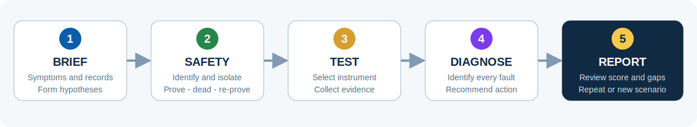

# CG303 Fault Lab - Operation Manual

Manual version: 1.3

Applies to simulator baseline: commit `3f110c5`

Last updated: 15 July 2026

## Workflow at a glance

Start with this complete process before following the detailed instructions.



## 1. Important notice

CG303 Fault Lab is an independent learning aid containing original practice
material. It is not affiliated with or endorsed by City & Guilds. It does not
certify competence and must not replace supervised practical training, approved
safe-isolation procedures or the instructions supplied with real test equipment.

Never use a simulated reading as evidence about a real installation.

## 2. Starting the simulator

### Online

Open the [CG303 Fault Lab online simulator](https://ckleung17.github.io/cg303-simulator/)
in a current browser. No account is needed.

### Local copy

From the project directory, start a static server:

```powershell
python -m http.server 8000
```

Open `http://localhost:8000`. Opening `index.html` directly may prevent browser
modules and offline caching from operating.

### Installing on a phone or tablet

Use the browser's Add to Home Screen or Install App command. After the files have
been cached once, the installed simulator can normally reopen without a network
connection. Browser-specific installation wording varies.

## 3. Selecting a learning mode

The start page repeats the five-stage overview. The numbered navigation opens
each working stage.

Use the Mode selector at the top of the page:

- **Guided:** shows explanatory feedback after tests.
- **Practice:** reduces guidance while retaining the final report.
- **Exam-style:** minimises immediate teaching feedback.

Changing mode does not change the hidden fault combination. Select **New fault**
to generate a different seed and scenario.

## 4. Stage 1 ? Brief

1. Read the customer complaint.
2. Note the circuit type, supply, protective device, conductor details and
   previous result.
3. Select the information-gathering actions you completed.
4. Form at least two plausible initial hypotheses.
5. Select **Continue to safety**.

The scenario seed is displayed near the heading. Record it if you want to repeat
or discuss the same exercise.

A tutor may open a reproducible scenario directly by adding `?seed=ABC123` to
the simulator URL, replacing `ABC123` with the displayed hexadecimal seed.

## 5. Stage 2 ? Safety

Complete the displayed safe-isolation actions in order. The simulator expects:

1. Permission, circuit identification and communication.
2. Inspection and proving of the voltage indicator.
3. Switching off, isolation and lock-off.
4. Warning notice and control of the key.
5. Testing for dead between the required conductors.
6. Re-proving the voltage indicator.

Selecting a later step prematurely records an out-of-sequence safety action.
Testing remains locked until all six actions are complete.

## 6. Stage 3 ? Testing

1. Review the diagram and its labelled test terminals.
2. Select an instrument.
3. Select the instrument function.
4. Select two terminal buttons. They become the two meter leads.
5. Select **Take reading**.
6. Interpret the reading and add further discriminating tests if necessary.

Use **Clear leads** to cancel the selection. The terminal buttons are designed
for mouse, keyboard or touch and replace any need to drag graphical probes.

The available instruments are:

- Two-pole voltage indicator.
- Low-resistance ohmmeter.
- Insulation-resistance tester.

Results appear on the meter, in the test record and in the evidence notebook.
`OL` means the simulated meter indicates an open circuit or an out-of-range
resistance path in that test context.

## 7. Stage 4 ? Diagnosis

1. Compare the complaint with the recorded results.
2. Select every fault supported by the evidence. A scenario can contain one,
   two or three compatible faults.
3. Enter a sentence explaining which evidence supports the diagnosis.
4. Select the safest appropriate corrective-action category.
5. Select **Submit diagnosis**.

A correct fault name without useful testing, safe procedure or reasoning will
not receive the full score.

## 8. Stage 5 ? Report

The report displays:

- Overall percentage.
- Hidden fault and recommended action.
- Your submitted reasoning.
- Results mapped to Unit 303 learning-outcome themes.

Use **Repeat seed** to restart the exact scenario or **Generate new fault** for a
different exercise. Previous summary results may be retained only in the current
browser's local storage.

## 9. Circuit families

Random generation draws from radial, ring-final, lighting, dedicated-load,
contactor-control and three-phase motor scenarios. It activates one to three
faults within the chosen family and shuffles their symptom order. The diagram
labels, supply, protection, terminals and likely measurements change with the
selected family and combination.

Because the choice is seeded, several consecutive scenarios can occasionally
come from the same family. Continue selecting **New fault** to broaden coverage.
The same seed reproduces the same ordered combination, which is useful for tutor
discussion and repeat attempts.

### Diagnosing combined faults

Do not stop automatically after finding the first abnormal result. Compare every
reported symptom with the fault already identified. If one symptom remains
unexplained, form another hypothesis and choose a test that discriminates it.
Before submitting, ensure that:

- Each selected diagnosis is supported by a recorded result or symptom.
- Each significant symptom is explained by at least one selected fault.
- Key evidence has been collected for every suspected fault.
- Unrelated options have not been selected merely because multiple answers are
  permitted.

The final report states how many active faults had their key evidence found and
only awards the complete diagnosis score when the selected set exactly matches
the active set.

## 10. Worked example - diagnosing an open neutral

This single-fault example demonstrates the reasoning expected in the simulator.
The same evidence-led loop is repeated when a generated scenario contains
additional symptoms. It is not an
instruction to work on a real installation without appropriate training,
authorisation, supervision and safe working procedures.

### Scenario information

The generated exercise is a 230 V radial socket circuit protected by a B20 RCBO.
The customer reports that SO1 works but equipment connected to SO2 does not. The
RCBO remains set. The hidden fault is not shown to the learner.

Possible initial hypotheses include:

- Open line conductor between SO1 and SO2.
- Open neutral conductor between SO1 and SO2.
- Failed or incorrectly terminated SO2 accessory.
- A local load fault, although the complaint should be confirmed with known
  information before assuming this.

### Step 1 - gather information

In the Brief stage:

1. Confirm that the loss of operation is limited to SO2.
2. Review the circuit schedule and previous R1+R2 result.
3. Record completion of the visual inspection.
4. Note that SO1 operating normally makes a complete upstream supply loss less
   likely, but does not yet distinguish line from neutral discontinuity at SO2.

### Step 2 - complete simulated safe isolation

In the Safety stage, select each action in the displayed order:

1. Obtain permission, identify the circuit and inform affected persons.
2. Inspect the two-pole voltage indicator and prove it using the proving unit.
3. Switch off, isolate and lock off the correct protective device.
4. Display the warning notice and retain control of the lock-off key.
5. Confirm dead between line-neutral, line-earth and neutral-earth.
6. Re-prove the voltage indicator.

The simulator blocks resistance testing until this sequence is complete. An
out-of-order selection is recorded as a safety error.

### Step 3 - select a discriminating test

The most useful first dead test is conductor continuity between the last known
working point and the non-working point.

1. Open the Test stage.
2. Select **Low-resistance ohmmeter**.
3. Select the **Continuity** function.
4. Select **SO1 Neutral** as Lead A.
5. Select **SO2 Neutral** as Lead B.
6. Select **Take reading**.

For this scenario, the simulated meter displays `OL`. Record the meaning rather
than merely copying the value: there is no neutral continuity between SO1 and
SO2.

### Step 4 - confirm the diagnosis logically

A single reading should be considered alongside other evidence. Repeat the
continuity test between **SO1 Line** and **SO2 Line**. The simulator returns a low
resistance of approximately `0.12 ohm`, showing that the line path is continuous.

The combined evidence is:

- SO1 operates normally.
- SO2 does not operate.
- Line continuity from SO1 to SO2 is present.
- Neutral continuity from SO1 to SO2 is absent.

This evidence supports **Open neutral between SO1 and SO2** and distinguishes it
from an open line conductor.

Avoid taking numerous unrelated readings once the evidence already discriminates
between the reasonable hypotheses. A logical sequence is part of the assessment.

### Step 5 - enter the diagnosis and action

In the Diagnose stage:

1. Select **Open neutral between SO1 and SO2**.
2. Enter reasoning such as: "SO1 operates and line continuity to SO2 measures
   0.12 ohm, but neutral continuity between SO1 and SO2 is OL, indicating an open
   neutral in that section."
3. Select the corrective category that repairs the affected conductor or
   termination and completes appropriate verification.
4. Submit the diagnosis.

### Step 6 - state the correction and verification

The appropriate recommendation is to locate and correctly repair the open
neutral connection or conductor. Before simulated restoration, the work should
be followed by the relevant verification, including:

- Confirming restored neutral continuity.
- Confirming protective-conductor continuity remains satisfactory.
- Verifying polarity.
- Completing appropriate insulation-resistance and functional checks.
- Recording the work and informing the relevant person before restoration.

The simulator reports the hidden fault, recommended action and scores for safety,
information gathering, test evidence, diagnosis, correction and reasoning.

### Why this test sequence works

The complaint alone cannot identify which conductor is open. Testing neutral
continuity directly targets one hypothesis. Testing line continuity provides a
comparison that excludes the main alternative. The conclusion therefore follows
from two related results rather than guesswork.

## 11. Mobile and accessibility operation

- Rotate the device if a larger circuit view is helpful.
- The layout changes to a single column on phones.
- The New fault control keeps its label centred at narrow widths, and the two
  manual downloads appear on separate footer lines for easier touch selection.
- Use browser zoom or text-size controls as required.
- All major controls meet touch-target sizing requirements.
- Use Tab and Shift+Tab to move through controls with a keyboard.
- Press Space or Enter to activate the focused button or selection.
- Terminal selection does not depend on colour or drag-and-drop.

## 12. Troubleshooting

### The application remains on loading

Serve the files over HTTP/HTTPS and confirm JavaScript is enabled. Refresh after
clearing an obsolete site cache if the application was recently updated.

### The offline version appears outdated

Reconnect, open the online application, refresh it, then close and reopen the
installed version. This allows the new service-worker cache to activate.

### A reading cannot be taken

Confirm safe isolation is complete, an instrument/function is selected and two
different terminals have been selected.

### Progress disappeared

Attempt history is stored locally and can be removed by private browsing,
clearing site data or changing device/browser. It is not synchronised online.

## 13. Suggested study method

1. Begin in Guided mode and record why each test is useful.
2. Repeat the seed in Practice mode using fewer tests.
3. Use Exam-style mode only after you can justify instrument choice and sequence.
4. Practise every circuit family and compare symptoms that appear similar.
5. Discuss unexpected results with a qualified tutor.

## 14. Manual maintenance

This manual must be updated in the same commit whenever simulator controls,
workflow, modes, circuit families, instruments, scoring, storage, installation or
device support changes. Amend the version, date and applicable simulator baseline
when preparing a release.
